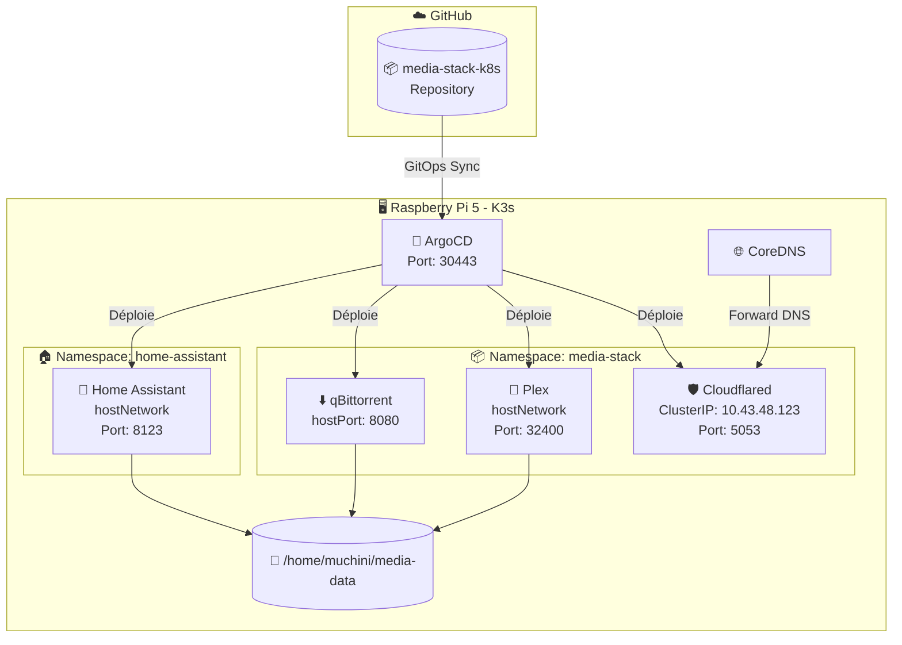
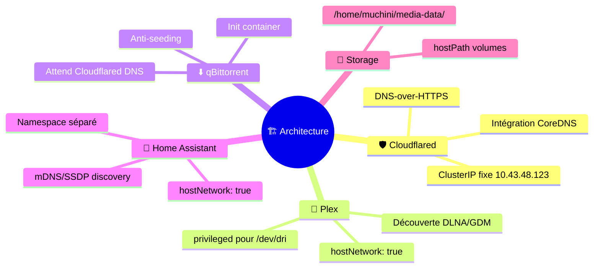
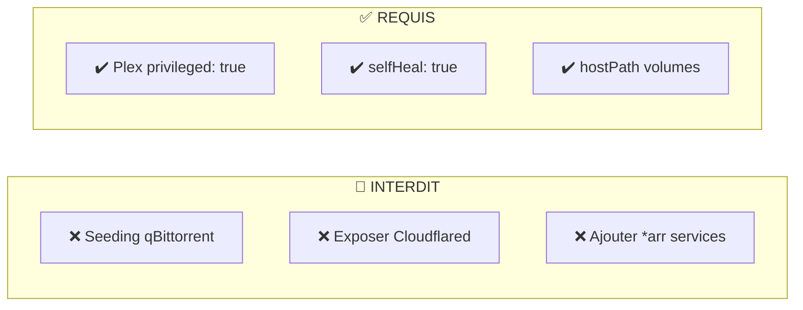
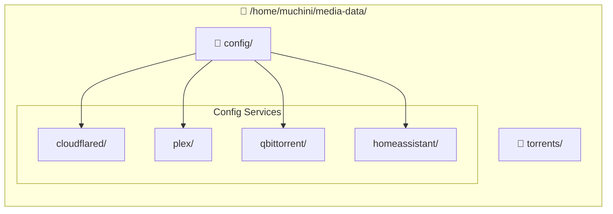
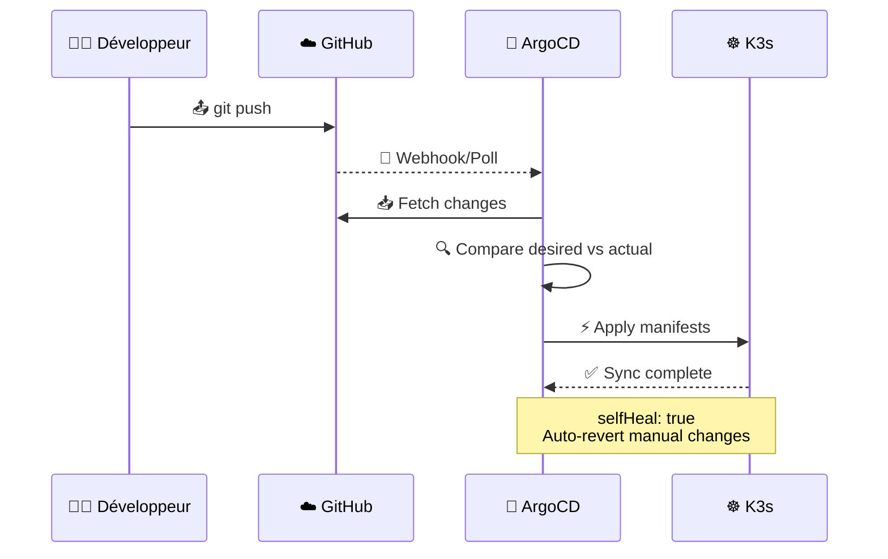

# 🤖 CLAUDE.md

Ce fichier fournit des instructions à Claude Code (claude.ai/code) pour travailler avec ce repository.

## 📋 Vue d'ensemble du projet

Stack média K3s déployée via ArgoCD GitOps sur **Raspberry Pi 5 (arm64)**. Utilise le pattern **App of Apps** où `apps/root-app.yaml` est l'application parente qui synchronise toutes les applications enfants.

## 🏗️ Architecture



## 🎯 Décisions de conception clés



| Composant | Configuration | Raison |
|-----------|--------------|--------|
| 🛡️ Cloudflared | ClusterIP fixe `10.43.48.123` | Intégration CoreDNS |
| 🎥 Plex | `hostNetwork: true` | Découverte DLNA/GDM |
| ⬇️ qBittorrent | Init container | Attend Cloudflared DNS |
| 🏡 Home Assistant | `hostNetwork: true` | Découverte mDNS/SSDP |
| 🏡 Home Assistant | Namespace `home-assistant` | Isolation |
| 💾 Tous les pods | `hostPath` volumes | Stockage `/home/muchini/media-data/` |

## 🔧 Commandes

### ☸️ Déploiement

```bash
# 📥 Déployer tout (initial ou après changements)
kubectl apply -f apps/root-app.yaml

# 👀 Surveiller le statut de sync
kubectl get applications -n argocd -w

# 📊 Vérifier les pods
kubectl get pods -n media-stack
kubectl get pods -n home-assistant

# 🌐 UI ArgoCD
# https://192.168.1.51:30443

# 🔄 Forcer la sync d'une app spécifique
argocd app sync cloudflared
argocd app sync plex
argocd app sync qbittorrent
argocd app sync homeassistant
```

### 🧪 Test des Helm Charts

```bash
# ✅ Valider les templates
helm template charts/cloudflared
helm template charts/plex
helm template charts/qbittorrent
helm template charts/homeassistant

# 🔍 Linter les charts
helm lint charts/cloudflared
helm lint charts/plex
helm lint charts/qbittorrent
helm lint charts/homeassistant

# 🔒 Kube-linter (sécurité)
kube-linter lint charts/
```

## ⚠️ Contraintes critiques



| ⚠️ Règle | Description |
|---------|-------------|
| 🚫 **NE PAS** | Activer le seeding dans qBittorrent |
| 🚫 **NE PAS** | Exposer Cloudflared externellement (ClusterIP only) |
| 🚫 **NE PAS** | Ajouter les services *arr (Radarr, Sonarr, etc.) - intentionnellement exclus |
| ✅ **REQUIS** | Plex `privileged: true` pour transcodage HW via `/dev/dri` |
| ⚠️ **ATTENTION** | Toutes les apps ont `selfHeal: true` - les changements kubectl manuels seront annulés |

## 📂 Chemins des volumes



| Type | Chemin |
|------|--------|
| 📁 Config | `/home/muchini/media-data/config/{service}/` |
| 🎬 Media | `/media/` |
| ⬇️ Torrents | `/home/muchini/media-data/torrents/` |

## 🔄 Workflow GitOps


