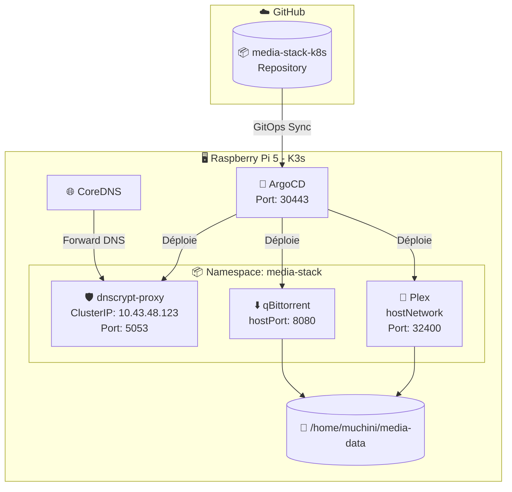
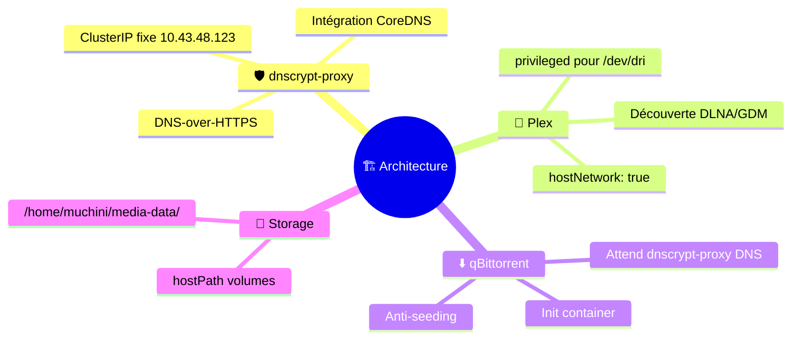
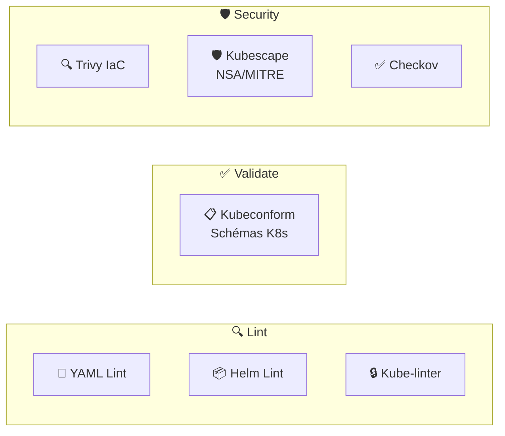
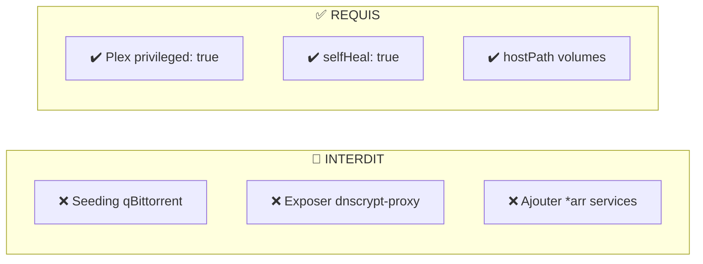
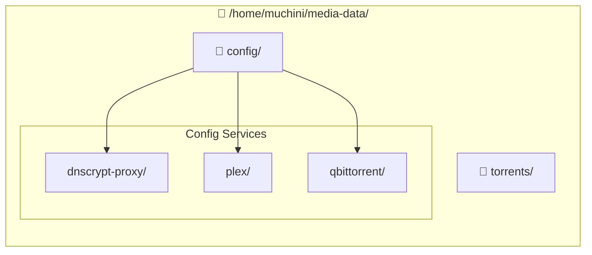
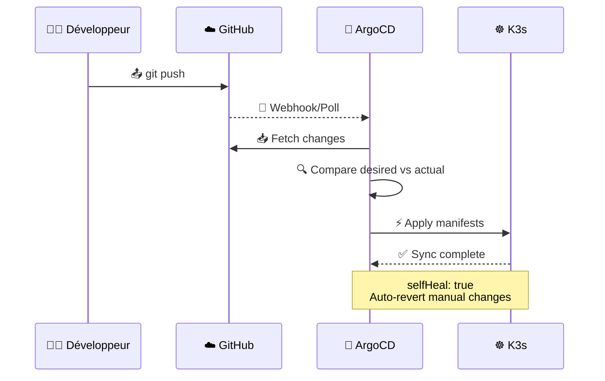

# 🤖 CLAUDE.md

Ce fichier fournit des instructions à Claude Code (claude.ai/code) pour travailler avec ce repository.

## 📋 Vue d'ensemble du projet

Stack média K3s déployée via ArgoCD GitOps sur **Raspberry Pi 5 (arm64)**. Utilise le pattern **App of Apps** où `apps/root-app.yaml` est l'application parente qui synchronise toutes les applications enfants.

## 📂 Structure du projet

```
media-stack-k8s/
├── 📂 apps/                    # Applications ArgoCD
│   ├── root-app.yaml           # App parente (point d'entrée)
│   ├── namespace.yaml          # Namespace media-stack
│   ├── dnscrypt-proxy.yaml        # App dnscrypt-proxy
│   ├── plex.yaml               # App Plex
│   ├── qbittorrent.yaml        # App qBittorrent
│   ├── priority-classes.yaml   # Classes de priorité
│   └── resource-quota.yaml     # Quotas de ressources
├── 📂 base/                    # Ressources K8s de base
│   └── namespace.yaml          # Namespace media-stack
├── 📂 charts/                  # Helm Charts
│   ├── dnscrypt-proxy/
│   ├── plex/
│   └── qbittorrent/
├── 📂 .github/workflows/       # CI/CD GitHub Actions
│   └── validate.yaml           # Pipeline de validation
├── .yamllint.yaml              # Config yamllint
├── .kube-linter.yaml           # Config kube-linter
└── CLAUDE.md                   # Ce fichier
```

## 🏗️ Architecture



## 🎯 Décisions de conception clés



| Composant | Configuration | Raison |
|-----------|--------------|--------|
| 🛡️ dnscrypt-proxy | ClusterIP fixe `10.43.48.123` | Intégration CoreDNS |
| 🎥 Plex | `hostNetwork: true` | Découverte DLNA/GDM |
| ⬇️ qBittorrent | Init container | Attend dnscrypt-proxy DNS |
| 💾 Tous les pods | `hostPath` volumes | Stockage `/home/muchini/media-data/` |

## 🔧 Commandes

### ☸️ Déploiement

```bash
# 📥 Déployer tout (initial ou après changements)
kubectl apply -f apps/root-app.yaml

# 👀 Surveiller le statut de sync
kubectl get applications -n argocd -w

# 📊 Vérifier les pods
kubectl get pods -n media-stack

# 🌐 UI ArgoCD
# https://192.168.1.51:30443

# 🔄 Forcer la sync d'une app spécifique
argocd app sync dnscrypt-proxy
argocd app sync plex
argocd app sync qbittorrent
```

### 🧪 Test des Helm Charts (local)

```bash
# ✅ Valider les templates
helm template charts/dnscrypt-proxy
helm template charts/plex
helm template charts/qbittorrent

# 🔍 Linter les charts
helm lint charts/dnscrypt-proxy
helm lint charts/plex
helm lint charts/qbittorrent

# 📝 YAML Lint
yamllint -c .yamllint.yaml .

# 🔒 Kube-linter (sécurité)
kube-linter lint charts/

# ✅ Kubeconform (validation schémas K8s)
helm template charts/dnscrypt-proxy | kubeconform -strict -summary
```

### 🔄 CI/CD GitHub Actions

Le pipeline `.github/workflows/validate.yaml` s'exécute sur chaque push/PR et inclut:



| Job | Outils | Description |
|-----|--------|-------------|
| 🔍 Lint | yamllint, helm lint, kube-linter | Validation syntaxe et bonnes pratiques |
| ✅ Validate | kubeconform | Validation schémas Kubernetes |
| 🛡️ Security | Trivy, Kubescape, Checkov | Scan sécurité IaC |

## 📊 Gouvernance des ressources

### 🎯 Priority Classes

Définies dans `apps/priority-classes.yaml` pour gérer l'éviction des pods:

| Classe | Valeur | Services |
|--------|--------|----------|
| 🔴 `media-critical` | 1,000,000 | dnscrypt-proxy (DNS) |
| 🟠 `media-high` | 900,000 | Plex, qBittorrent |
| 🟢 `media-normal` | 800,000 | (Réservé) |

### 📏 Resource Quotas

Définis dans `apps/resource-quota.yaml` pour le namespace `media-stack`:

| Ressource | Requests | Limits |
|-----------|----------|--------|
| CPU | 4 cores | 6 cores |
| Memory | 6 Gi | 8 Gi |

### 🛡️ PodDisruptionBudgets

Chaque chart inclut un PDB (`templates/pdb.yaml`) avec `minAvailable: 1` pour garantir la disponibilité pendant les maintenances.

## ⚠️ Contraintes critiques



| ⚠️ Règle | Description |
|---------|-------------|
| 🚫 **NE PAS** | Activer le seeding dans qBittorrent |
| 🚫 **NE PAS** | Exposer dnscrypt-proxy externellement (ClusterIP only) |
| 🚫 **NE PAS** | Ajouter les services *arr (Radarr, Sonarr, etc.) - intentionnellement exclus |
| ✅ **REQUIS** | Plex `privileged: true` pour transcodage HW via `/dev/dri` |
| ⚠️ **ATTENTION** | Toutes les apps ont `selfHeal: true` - les changements kubectl manuels seront annulés |

## 📂 Chemins des volumes



| Type | Chemin |
|------|--------|
| 📁 Config | `/home/muchini/media-data/config/{service}/` |
| 🎬 Media | `/media/` |
| ⬇️ Torrents | `/home/muchini/media-data/torrents/` |

## 🔄 Workflow GitOps


