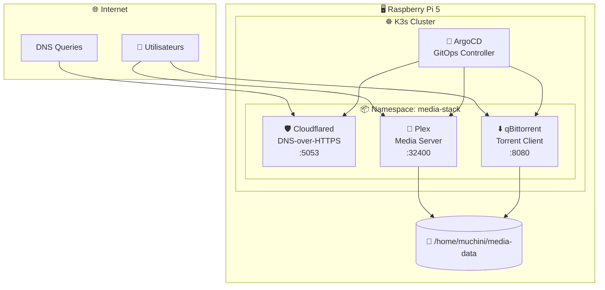
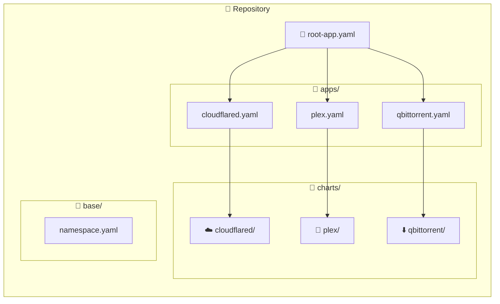
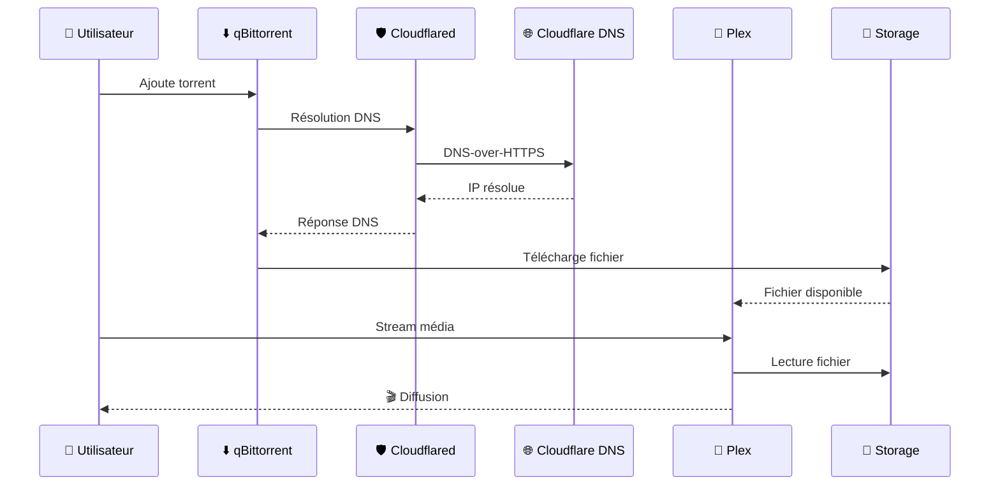

# 🎬 Media Stack K8s

Stack média déployée sur K3s avec ArgoCD (GitOps) sur Raspberry Pi 5.

## 📋 Vue d'ensemble



## 🚀 Services

| Service | Description | Port | Namespace | Statut |
|---------|-------------|------|-----------|--------|
| 🛡️ Cloudflared | DNS over HTTPS (anti-censure) | ClusterIP 5053 | media-stack | ✅ |
| 🎥 Plex | Media Server avec transcodage HW | 32400 (hostNetwork) | media-stack | ✅ |
| ⬇️ qBittorrent | Client torrent (anti-seeding) | 8080 (hostPort) | media-stack | ✅ |

## 🔧 Déploiement

```bash
# 📥 Appliquer le root app (App of Apps pattern)
kubectl apply -f apps/root-app.yaml

# 👀 Suivre le déploiement
kubectl get applications -n argocd -w
```

## 🌐 Accès

| Service | URL |
|---------|-----|
| 🔄 ArgoCD | https://192.168.1.51:30443 |
| 🎥 Plex | http://192.168.1.51:32400/web |
| ⬇️ qBittorrent | http://192.168.1.51:8080 |

## 📁 Structure du projet



```
📦 media-stack-k8s/
├── 📁 apps/               # ArgoCD Application manifests
│   ├── 📄 root-app.yaml   # App of Apps parent
│   ├── 📄 cloudflared.yaml
│   ├── 📄 plex.yaml
│   └── 📄 qbittorrent.yaml
├── 📁 base/               # Ressources de base
│   └── 📄 namespace.yaml
└── 📁 charts/             # Helm Charts
    ├── ☁️ cloudflared/
    ├── 🎥 plex/
    └── ⬇️ qbittorrent/
```

## ⚠️ Contraintes importantes

> 🚫 **NE PAS** activer le seeding dans qBittorrent
> 🚫 **NE PAS** exposer Cloudflared externellement
> 🚫 **NE PAS** ajouter les services *arr (Radarr, Sonarr, etc.)

## 📊 Flux de données


