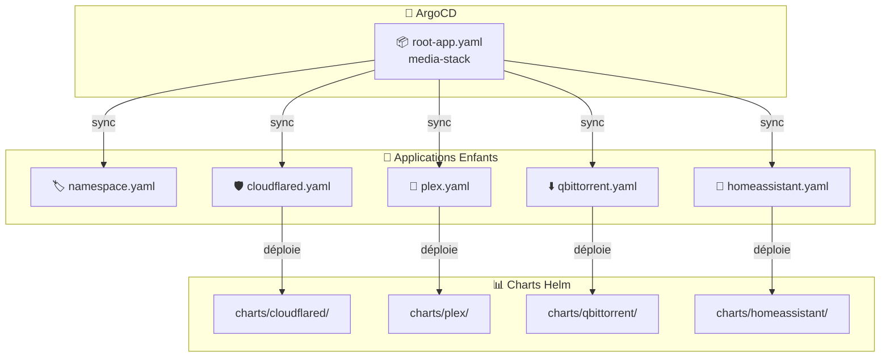
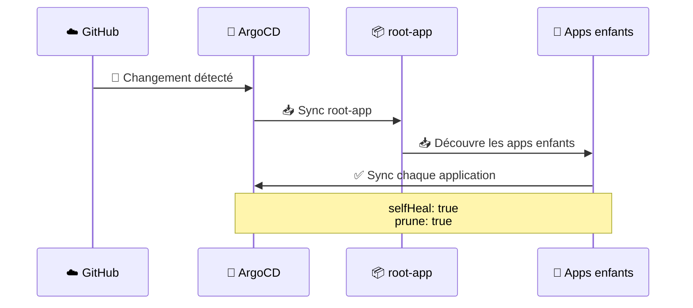

# 📁 Apps - Applications ArgoCD

Ce dossier contient les définitions des **Applications ArgoCD** qui orchestrent le déploiement de la stack média via GitOps.

## 🏗️ Architecture App of Apps



## 📄 Fichiers

| Fichier | Description |
|---------|-------------|
| 🚀 `root-app.yaml` | Application parente - Point d'entrée ArgoCD |
| 🏷️ `namespace.yaml` | Crée le namespace media-stack |
| 🛡️ `cloudflared.yaml` | Déploie le proxy DNS-over-HTTPS |
| 🎥 `plex.yaml` | Déploie Plex Media Server |
| ⬇️ `qbittorrent.yaml` | Déploie qBittorrent |
| 🏡 `homeassistant.yaml` | Déploie Home Assistant |

## 🔄 Flux de synchronisation



## ⚙️ Configuration commune

Toutes les applications partagent:

- **`selfHeal: true`** - Annule les changements manuels kubectl
- **`prune: true`** - Supprime les ressources obsolètes
- **`CreateNamespace: true`** - Crée les namespaces automatiquement

## 🎯 Utilisation

```bash
# 📥 Déployer toute la stack
kubectl apply -f apps/root-app.yaml

# 👀 Surveiller les applications
kubectl get applications -n argocd

# 🔄 Forcer la sync d'une app
argocd app sync cloudflared
```
