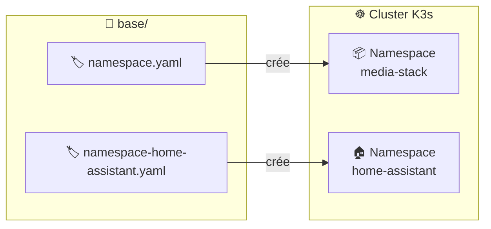
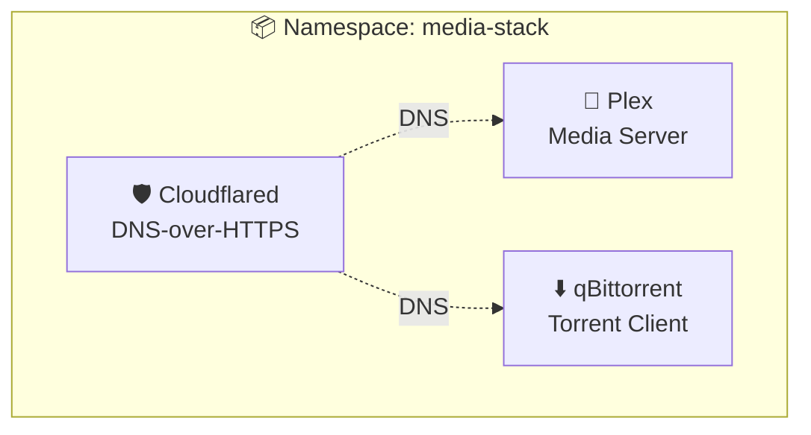

# 📁 Base - Ressources Kubernetes de base

Ce dossier contient les **ressources Kubernetes fondamentales** partagées par toutes les applications de la stack.

## 🎯 Objectif



## 📄 Fichiers

| Fichier | Type | Description |
|---------|------|-------------|
| 🏷️ `namespace.yaml` | Namespace | Définit le namespace `media-stack` |
| 🏷️ `namespace-home-assistant.yaml` | Namespace | Définit le namespace `home-assistant` |

## 🏷️ Namespace media-stack

```yaml
apiVersion: v1
kind: Namespace
metadata:
  name: media-stack
  labels:
    app.kubernetes.io/managed-by: argocd
```

### 📊 Services déployés dans ce namespace



## 🏠 Namespace home-assistant

Le namespace `home-assistant` est défini dans `namespace-home-assistant.yaml` et géré via GitOps. Il est séparé car Home Assistant nécessite une **isolation** pour:
- Sa propre configuration réseau (`hostNetwork`)
- Ses intégrations mDNS/SSDP
- Une gestion indépendante des mises à jour

```yaml
apiVersion: v1
kind: Namespace
metadata:
  name: home-assistant
  labels:
    app.kubernetes.io/managed-by: argocd
```

## 🔧 Utilisation

```bash
# 📥 Appliquer le namespace manuellement (si nécessaire)
kubectl apply -f base/namespace.yaml

# ✅ Vérifier l'existence
kubectl get namespace media-stack

# 📊 Voir les ressources du namespace
kubectl get all -n media-stack
```
