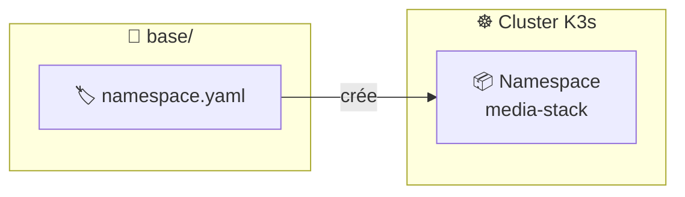
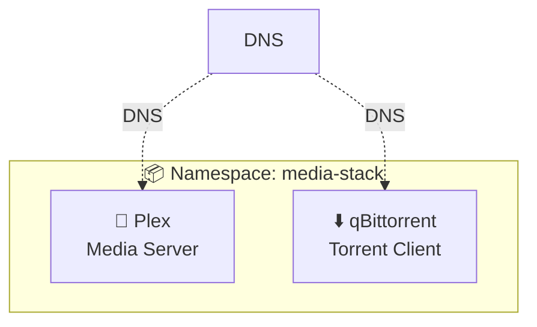

# 📁 Base - Ressources Kubernetes de base

Ce dossier contient les **ressources Kubernetes fondamentales** partagées par toutes les applications de la stack.

## 🎯 Objectif


```mermaid
graph LR
    subgraph "📂 base/"
        NS[🏷️ namespace.yaml]
    end

    subgraph "☸️ Cluster K3s"
        MediaStack[📦 Namespace<br/>media-stack]
    end

    NS -->|"crée"| MediaStack
```

## 📄 Fichiers

| Fichier | Type | Description |
|---------|------|-------------|
| 🏷️ `namespace.yaml` | Namespace | Définit le namespace `media-stack` |

## 🏷️ Namespace media-stack

```yaml
apiVersion: v1
kind: Namespace
metadata:
  name: media-stack
  labels:
    app.kubernetes.io/managed-by: argocd
```

### 📊 Services déployés dans ce namespace


```mermaid
graph TB
    subgraph "📦 Namespace: media-stack"
        PX[🎥 Plex<br/>Media Server]
        QB[⬇️ qBittorrent<br/>Torrent Client]
    end

    DNS -.->|"DNS"| PX
    DNS -.->|"DNS"| QB
```

## 🔧 Utilisation

```bash
# 📥 Appliquer le namespace manuellement (si nécessaire)
kubectl apply -f base/namespace.yaml

# ✅ Vérifier l'existence
kubectl get namespace media-stack

# 📊 Voir les ressources du namespace
kubectl get all -n media-stack
```
