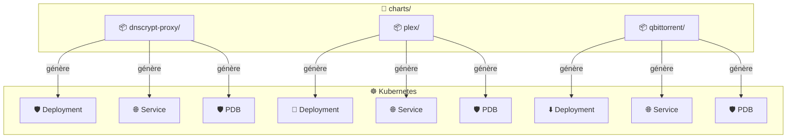
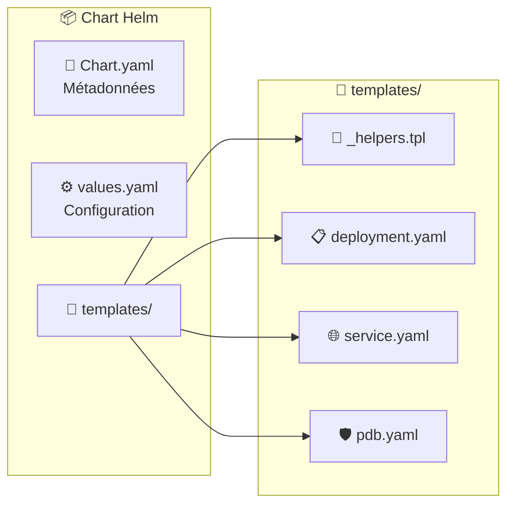

# 📁 Charts - Helm Charts

Ce dossier contient les **Helm Charts** personnalisés pour chaque service de la stack média.

## 🏗️ Architecture



## 📦 Charts disponibles

| Chart | Version | Description | Port |
|-------|---------|-------------|------|
| 🛡️ [dnscrypt-proxy](dnscrypt-proxy/) | 1.0.0 | DNS-over-HTTPS proxy | 5053 |
| 🎥 [plex](plex/) | 1.0.0 | Serveur média Plex | 32400 |
| ⬇️ [qbittorrent](qbittorrent/) | 1.0.0 | Client torrent | 8080 |

## 📂 Structure d'un chart



```
charts/
├── dnscrypt-proxy/
│   ├── Chart.yaml          # Métadonnées du chart
│   ├── values.yaml         # Valeurs par défaut
│   └── templates/
│       ├── _helpers.tpl    # Fonctions helper
│       ├── deployment.yaml # Définition du déploiement
│       ├── service.yaml    # Définition du service
│       └── pdb.yaml        # PodDisruptionBudget
├── plex/
│   └── templates/
│       ├── deployment.yaml
│       ├── service.yaml    # Service ClusterIP
│       └── pdb.yaml
└── qbittorrent/
    └── templates/
        ├── deployment.yaml
        ├── service.yaml
        └── pdb.yaml
```

## 🔧 Commandes utiles

```bash
# ✅ Valider un chart
helm lint charts/dnscrypt-proxy

# 👀 Prévisualiser les templates générés
helm template charts/dnscrypt-proxy

# 📊 Voir les valeurs d'un chart
helm show values charts/plex

# 🔍 Valider avec kube-linter
kube-linter lint charts/
```

## 🎯 Conventions

| Convention | Description |
|------------|-------------|
| 📦 `Chart.yaml` | Définit le nom, version et description |
| ⚙️ `values.yaml` | Configuration par défaut personnalisable |
| 🔧 `_helpers.tpl` | Labels et sélecteurs standardisés |
| 📋 `deployment.yaml` | Pod spec avec volumes, probes et lifecycle |
| 🌐 `service.yaml` | Exposition réseau |
| 🛡️ `pdb.yaml` | PodDisruptionBudget (haute disponibilité) |

## 🏥 Probes standardisées

Tous les charts utilisent:
- **startupProbe** - Détection du démarrage (évite les kills prématurés)
- **livenessProbe** - Redémarre si le pod est bloqué
- **readinessProbe** - Retire du service si pas prêt
- **lifecycle.preStop** - Graceful shutdown (sleep)
