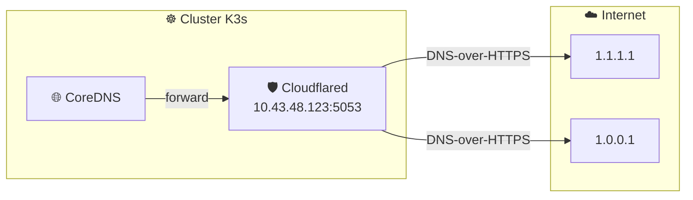
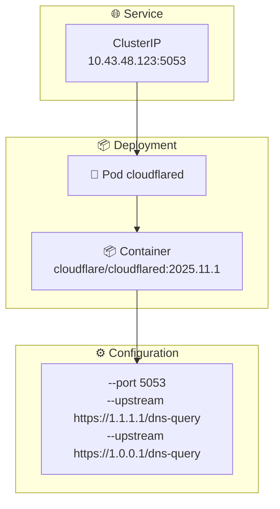

# 🛡️ Cloudflared - DNS-over-HTTPS Proxy

Helm chart pour déployer **Cloudflare DNS-over-HTTPS** proxy dans K3s.

## 🎯 Objectif



## 📄 Fichiers

| Fichier | Description |
|---------|-------------|
| 📄 `Chart.yaml` | Métadonnées du chart (v1.0.0, appVersion 2025.11.1) |
| ⚙️ `values.yaml` | Configuration par défaut |
| 📂 `templates/` | Templates Kubernetes |

### 📂 Templates

| Template | Ressource | Description |
|----------|-----------|-------------|
| 🔧 `_helpers.tpl` | - | Fonctions helper (labels, selectors) |
| 📋 `deployment.yaml` | Deployment | Pod Cloudflared avec startupProbe |
| 🌐 `service.yaml` | Service | ClusterIP fixe |
| 🛡️ `pdb.yaml` | PodDisruptionBudget | Garantit disponibilité minimale |

## ⚙️ Configuration

```yaml
# values.yaml
image:
  repository: cloudflare/cloudflared
  tag: "2025.11.1"

service:
  type: ClusterIP
  port: 5053
  clusterIP: "10.43.48.123"  # ⚠️ IP fixe pour CoreDNS

dns:
  upstreams:
    - "https://1.1.1.1/dns-query"
    - "https://1.0.0.1/dns-query"

resources:
  limits:
    memory: 64Mi
    cpu: 100m

nodeSelector:
  kubernetes.io/arch: arm64
```

## 🏗️ Architecture



## 🏥 Probes & Haute disponibilité

| Probe | Configuration |
|-------|---------------|
| **livenessProbe** | TCP 5053, delay 10s, period 30s |
| **readinessProbe** | TCP 5053, delay 5s, period 10s |
| **startupProbe** | TCP 5053, period 5s, 12 tentatives max |
| **PDB** | minAvailable: 1 |
| **preStop** | sleep 5s (graceful shutdown) |

## ⚠️ Points critiques

| ⚠️ | Description |
|----|-------------|
| 🔒 | **ClusterIP only** - Ne jamais exposer externellement |
| 📍 | **IP fixe** `10.43.48.123` - Requis pour CoreDNS forwarding |
| 🔗 | **Dépendance** - qBittorrent attend ce service au démarrage |
| 🖥️ | **arm64** - NodeSelector force le déploiement sur Raspberry Pi |

## 🔧 Commandes

```bash
# ✅ Valider le chart
helm lint charts/cloudflared
helm template charts/cloudflared

# 🔄 Forcer la sync ArgoCD
argocd app sync cloudflared

# 📊 Vérifier le pod
kubectl get pods -n media-stack -l app=cloudflared

# 🧪 Tester le DNS
kubectl run -n media-stack dns-test --rm -it --image=busybox -- \
  nslookup google.com 10.43.48.123
```
