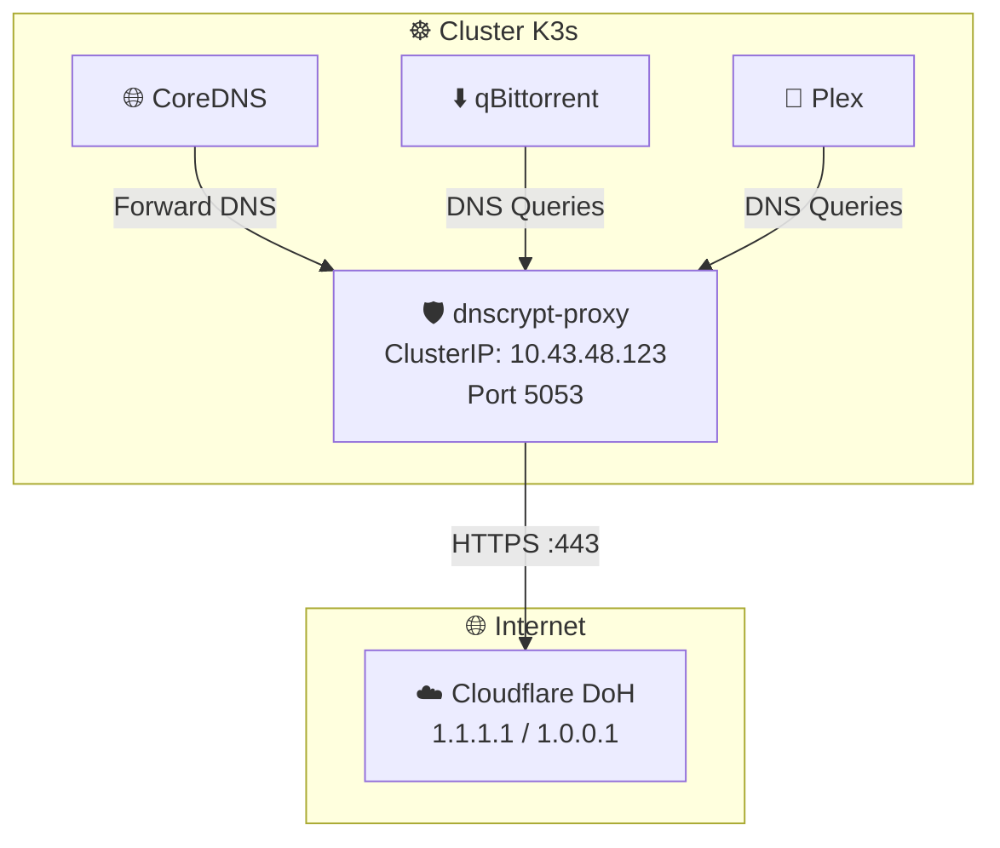
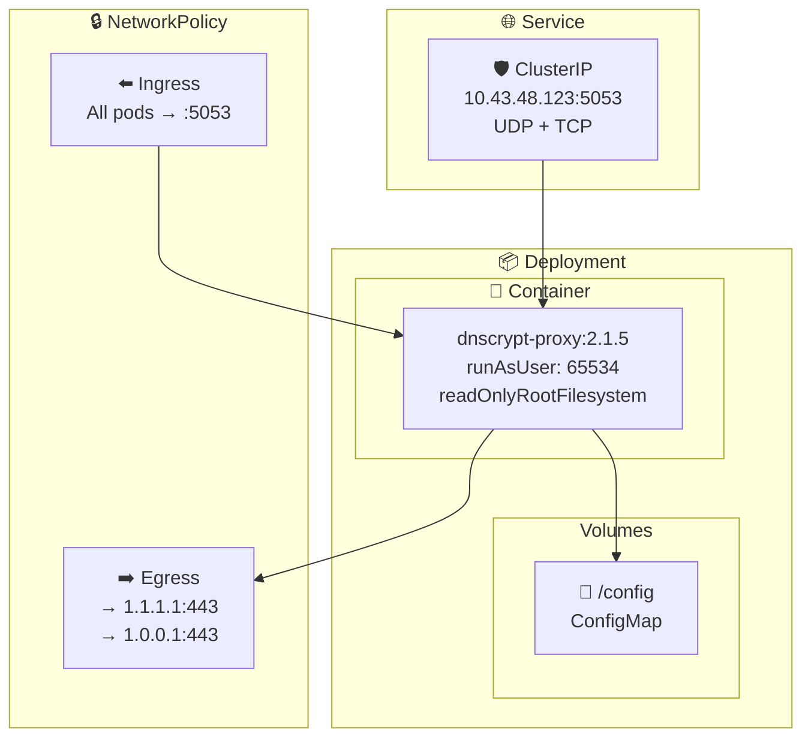
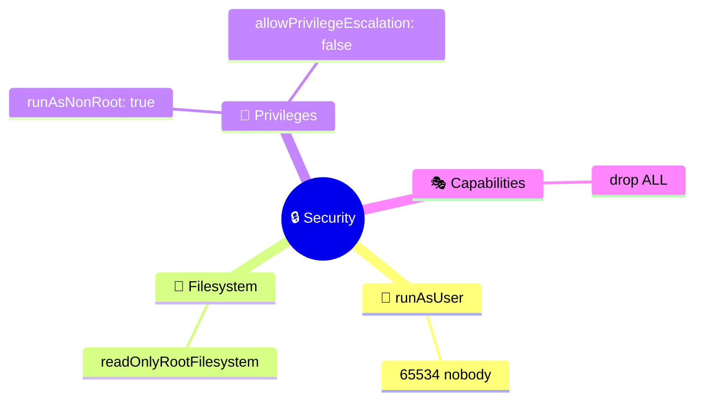
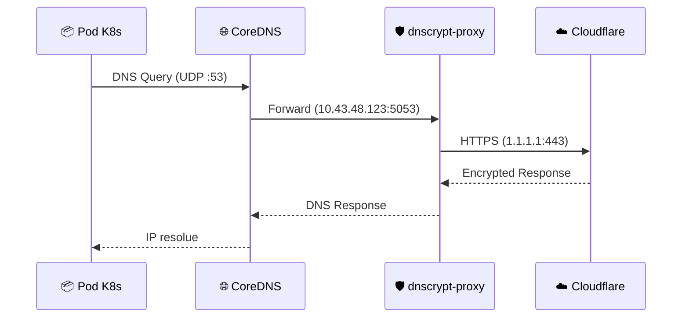
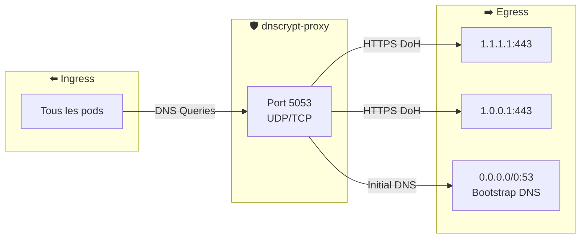
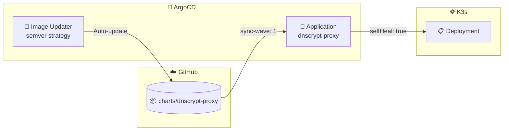

# 🛡️ dnscrypt-proxy - DNS-over-HTTPS Proxy

Helm chart pour deployer **dnscrypt-proxy** avec DNS-over-HTTPS securise via Cloudflare.

## 🎯 Objectif



## 📄 Fichiers

| Fichier | Description |
|---------|-------------|
| 📄 `Chart.yaml` | Metadonnees du chart (v1.0.0, appVersion 2.1.5) |
| ⚙️ `values.yaml` | Configuration par defaut |
| 📂 `templates/` | Templates Kubernetes |

### 📂 Templates

| Template | Ressource | Description |
|----------|-----------|-------------|
| 🔧 `_helpers.tpl` | - | Fonctions helper (labels, selectors) |
| 📋 `deployment.yaml` | Deployment | Pod avec probes et security context |
| 🌐 `service.yaml` | Service | ClusterIP fixe pour integration CoreDNS |
| 📜 `configmap.yaml` | ConfigMap | Configuration dnscrypt-proxy.toml |
| 🔒 `networkpolicy.yaml` | NetworkPolicy | Restreint trafic entrant/sortant |
| 🛡️ `pdb.yaml` | PodDisruptionBudget | Garantit disponibilite minimale |
| 📝 `NOTES.txt` | - | Instructions post-deploiement |

## ⚙️ Configuration

```yaml
# values.yaml
image:
  repository: klutchell/dnscrypt-proxy
  tag: "2.1.5"

service:
  type: ClusterIP
  port: 5053
  clusterIP: 10.43.48.123  # IP fixe pour CoreDNS

resources:
  limits:
    memory: 64Mi
    cpu: 100m
  requests:
    memory: 32Mi
    cpu: 50m

config:
  serverNames:
    - cloudflare
  listenAddresses:
    - "0.0.0.0:5053"
  doh: true
  cache: true
  cacheSize: 4096

priorityClassName: media-critical

nodeSelector:
  kubernetes.io/arch: arm64

networkPolicy:
  enabled: true
```

## 🏗️ Architecture



## 🔐 Security Context



Le container tourne avec les privileges minimaux:
- **runAsNonRoot**: Ne peut pas tourner en root
- **runAsUser: 65534**: Utilisateur nobody
- **readOnlyRootFilesystem**: Filesystem en lecture seule
- **drop ALL capabilities**: Aucune capability Linux

## 🌐 Integration CoreDNS



Pour integrer avec CoreDNS, modifier le ConfigMap `coredns` dans `kube-system`:

```yaml
forward . 10.43.48.123:5053
```

## 🏥 Probes & Haute disponibilite

| Probe | Configuration |
|-------|---------------|
| **startupProbe** | TCP 5053, period 5s, 12 tentatives max (1 min) |
| **livenessProbe** | TCP 5053, delay 10s, period 30s |
| **readinessProbe** | TCP 5053, delay 5s, period 10s |
| **PDB** | minAvailable: 1, unhealthyPodEvictionPolicy: AlwaysAllow |
| **preStop** | sleep 5s (graceful shutdown) |

## 🔒 NetworkPolicy



| Direction | Cible | Port | Description |
|-----------|-------|------|-------------|
| ⬅️ Ingress | Tous pods | 5053 UDP/TCP | Requetes DNS |
| ➡️ Egress | 1.1.1.1, 1.0.0.1 | 443 TCP | Cloudflare DoH |
| ➡️ Egress | 0.0.0.0/0 | 53 UDP | Bootstrap DNS |

## ⚠️ Points critiques

| ⚠️ | Description |
|----|-------------|
| 🔒 | **ClusterIP only** - Ne jamais exposer externellement |
| 🎯 | **IP fixe** - 10.43.48.123 pour integration CoreDNS |
| 🏆 | **media-critical** - Priorite maximale (eviction en dernier) |
| 🛡️ | **NetworkPolicy** - Limite le trafic sortant a Cloudflare |
| 🖥️ | **arm64** - NodeSelector force le deploiement sur Raspberry Pi |

## 🔧 Commandes

```bash
# ✅ Valider le chart
helm lint charts/dnscrypt-proxy
helm template charts/dnscrypt-proxy

# 🔄 Forcer la sync ArgoCD
argocd app sync dnscrypt-proxy

# 📊 Verifier le pod
kubectl get pods -n media-stack -l app.kubernetes.io/name=dnscrypt-proxy

# 📋 Voir les logs
kubectl logs -n media-stack -l app.kubernetes.io/name=dnscrypt-proxy -f

# 🧪 Tester la resolution DNS
kubectl run -it --rm dns-test --image=busybox --restart=Never -- \
  nslookup google.com 10.43.48.123

# 🔍 Verifier le service
kubectl get svc -n media-stack media-dnscrypt-proxy
```

## 🔄 ArgoCD



L'application ArgoCD inclut:
- **sync-wave: 1** - Deploye apres le namespace (wave 0)
- **selfHeal: true** - Annule les changements manuels
- **prune: true** - Supprime les ressources obsoletes
- **Image Updater** - Mise a jour automatique des images (strategie semver)
