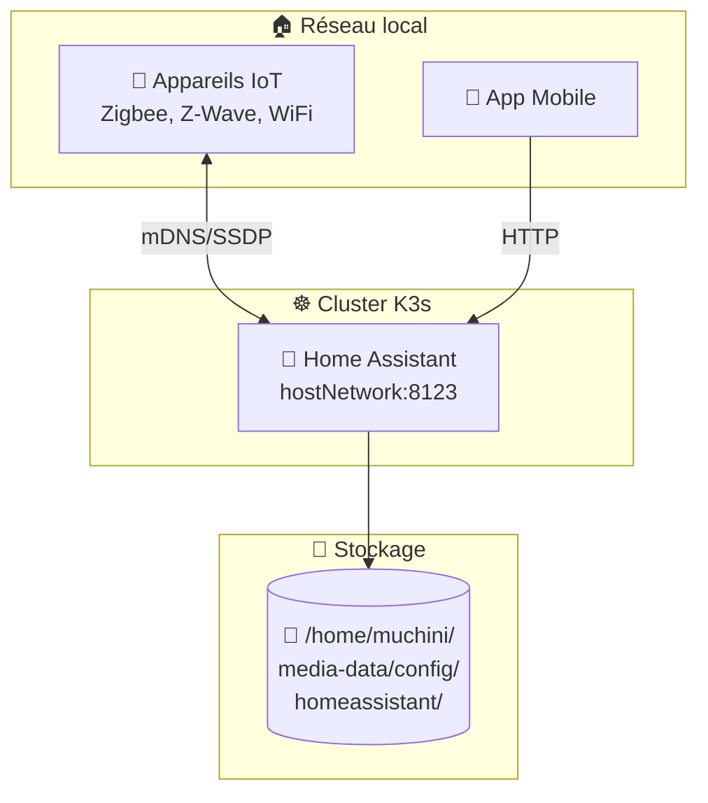
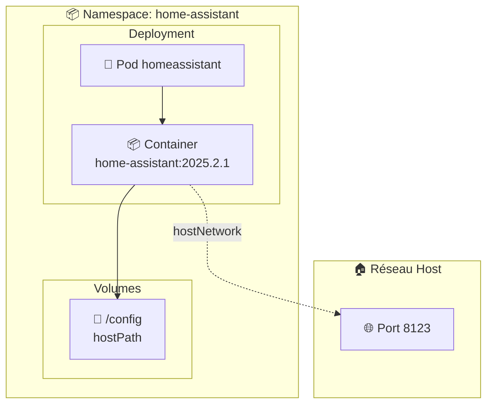
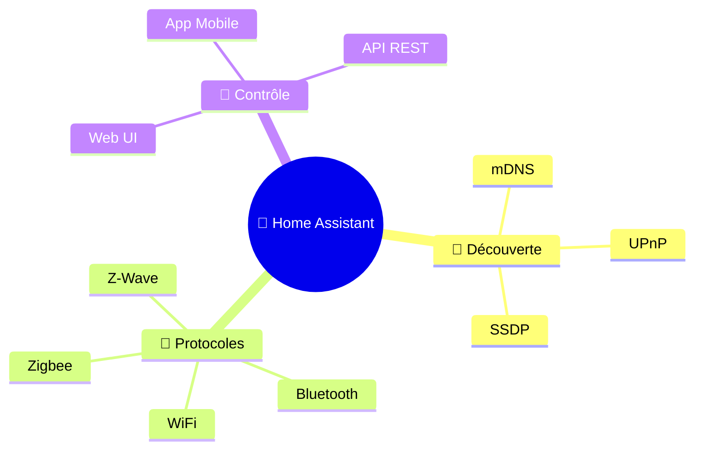

# 🏡 Home Assistant - Domotique Open Source

Helm chart pour déployer **Home Assistant** dans K3s avec support pour la découverte réseau.

## 🎯 Objectif



## 📄 Fichiers

| Fichier | Description |
|---------|-------------|
| 📄 `Chart.yaml` | Métadonnées du chart (v1.0.0, appVersion 2025.2.1) |
| ⚙️ `values.yaml` | Configuration par défaut |
| 📂 `templates/` | Templates Kubernetes |

### 📂 Templates

| Template | Ressource | Description |
|----------|-----------|-------------|
| 🔧 `_helpers.tpl` | - | Fonctions helper (labels, selectors) |
| 📋 `deployment.yaml` | Deployment | Pod Home Assistant avec probes |
| 🌐 `service.yaml` | Service | ClusterIP (optionnel avec hostNetwork) |
| 🛡️ `pdb.yaml` | PodDisruptionBudget | Garantit disponibilité minimale |

## ⚙️ Configuration

```yaml
# values.yaml
image:
  repository: ghcr.io/home-assistant/home-assistant
  tag: "2025.2.1"

# ⚠️ Requis pour découverte mDNS/SSDP
hostNetwork: true

persistence:
  config:
    hostPath: /home/muchini/media-data/config/homeassistant
    mountPath: /config

environment:
  TZ: "Europe/Paris"

resources:
  limits:
    memory: 1Gi
    cpu: 1000m

nodeSelector:
  kubernetes.io/arch: arm64
```

## 🏗️ Architecture



## 🔌 Intégrations supportées



## 🏥 Probes & Haute disponibilité

| Probe | Configuration |
|-------|---------------|
| **startupProbe** | HTTP /api/, period 10s, 30 tentatives max |
| **livenessProbe** | HTTP /api/, period 30s |
| **readinessProbe** | HTTP /api/, period 10s |
| **PDB** | minAvailable: 1 |
| **preStop** | sleep 10s (graceful shutdown) |

## ⚠️ Points critiques

| ⚠️ | Description |
|----|-------------|
| 🌐 | **hostNetwork: true** - Requis pour mDNS/SSDP |
| 📦 | **Namespace séparé** - `home-assistant` pour isolation |
| 💾 | **Données persistantes** - Sauvegarder `/config` régulièrement |
| 🔌 | **USB devices** - Activer `privileged: true` si Zigbee/Z-Wave |
| 🖥️ | **arm64** - NodeSelector force le déploiement sur Raspberry Pi |

## 🔧 Commandes

```bash
# ✅ Valider le chart
helm lint charts/homeassistant
helm template charts/homeassistant

# 🔄 Forcer la sync ArgoCD
argocd app sync homeassistant

# 📊 Vérifier le pod
kubectl get pods -n home-assistant

# 📋 Voir les logs
kubectl logs -n home-assistant -l app=homeassistant -f

# 🌐 Accéder à l'interface
# http://192.168.1.51:8123
```
