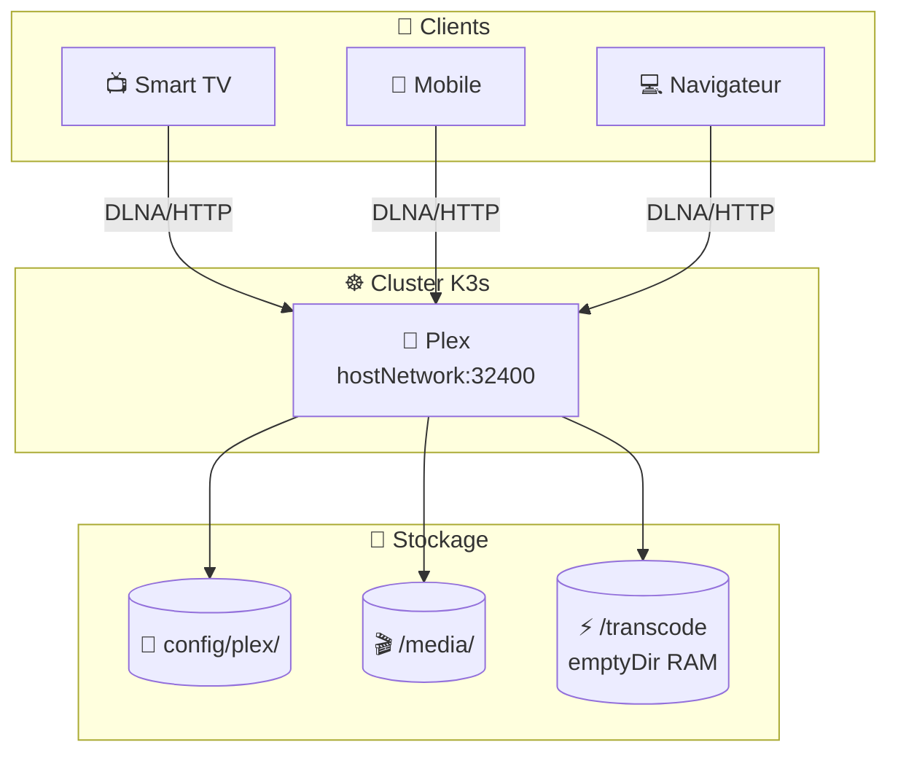
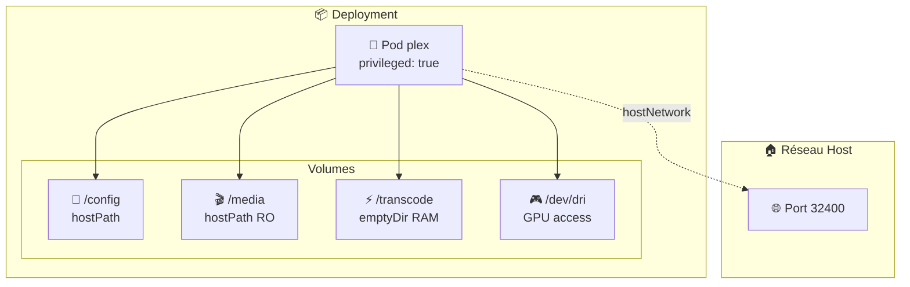

# 🎥 Plex - Media Server

Helm chart pour déployer **Plex Media Server** avec transcodage matériel sur Raspberry Pi 5.

## 🎯 Objectif



## 📄 Fichiers

| Fichier | Description |
|---------|-------------|
| 📄 `Chart.yaml` | Métadonnées du chart (v1.0.0, appVersion 1.43.0) |
| ⚙️ `values.yaml` | Configuration par défaut |
| 📂 `templates/` | Templates Kubernetes |

### 📂 Templates

| Template | Ressource | Description |
|----------|-----------|-------------|
| 🔧 `_helpers.tpl` | - | Fonctions helper (labels, selectors) |
| 📋 `deployment.yaml` | Deployment | Pod Plex avec GPU et probes |
| 🌐 `service.yaml` | Service | ClusterIP port 32400 |
| 🛡️ `pdb.yaml` | PodDisruptionBudget | Garantit disponibilité minimale |

## ⚙️ Configuration

```yaml
# values.yaml
image:
  repository: lscr.io/linuxserver/plex
  tag: "1.43.0"

# ⚠️ Requis pour découverte DLNA/GDM
hostNetwork: true

# ⚡ Transcodage matériel
gpu:
  enabled: true  # Accès à /dev/dri

persistence:
  config:
    hostPath: /home/muchini/media-data/config/plex
  media:
    hostPath: /media
    readOnly: true
  transcode:
    type: emptyDir
    medium: Memory  # RAM pour performance

environment:
  PUID: "1000"
  PGID: "1000"
  TZ: "Europe/Paris"

resources:
  limits:
    memory: 4Gi
    cpu: 3500m

service:
  type: ClusterIP
  port: 32400

nodeSelector:
  kubernetes.io/arch: arm64
```

## 🏗️ Architecture



## 🖥️ Transcodage matériel

```mermaid
graph LR
    subgraph "🎮 Raspberry Pi 5 GPU"
        DRI[/dev/dri/renderD128]
        Card[/dev/dri/card1]
    end

    subgraph "🎥 Plex"
        HW[Hardware Transcoding<br/>H.264/H.265]
    end

    DRI & Card -->|"privileged"| HW
```

## ⚠️ Points critiques

| ⚠️ | Description |
|----|-------------|
| 🔒 | **privileged: true** - Requis pour accès GPU `/dev/dri` |
| 🌐 | **hostNetwork: true** - Requis pour découverte DLNA/GDM |
| ⚡ | **emptyDir Memory** - Transcodage en RAM pour performance |
| 📁 | **Media readOnly** - Protection contre modifications accidentelles |

## 🔧 Commandes

```bash
# ✅ Valider le chart
helm lint charts/plex
helm template charts/plex

# 🔄 Forcer la sync ArgoCD
argocd app sync plex

# 📊 Vérifier le pod
kubectl get pods -n media-stack -l app=plex

# 📋 Voir les logs
kubectl logs -n media-stack -l app=plex -f

# 🌐 Accéder à l'interface
# http://192.168.1.51:32400/web

# 🎮 Vérifier l'accès GPU
kubectl exec -n media-stack -l app=plex -- ls -la /dev/dri/
```
