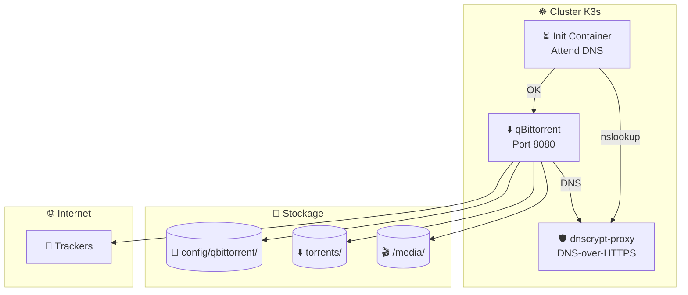
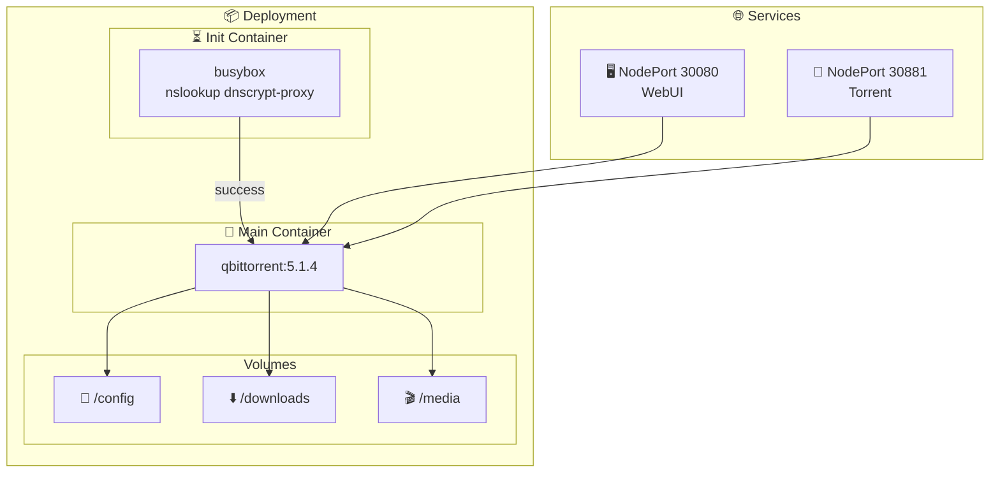
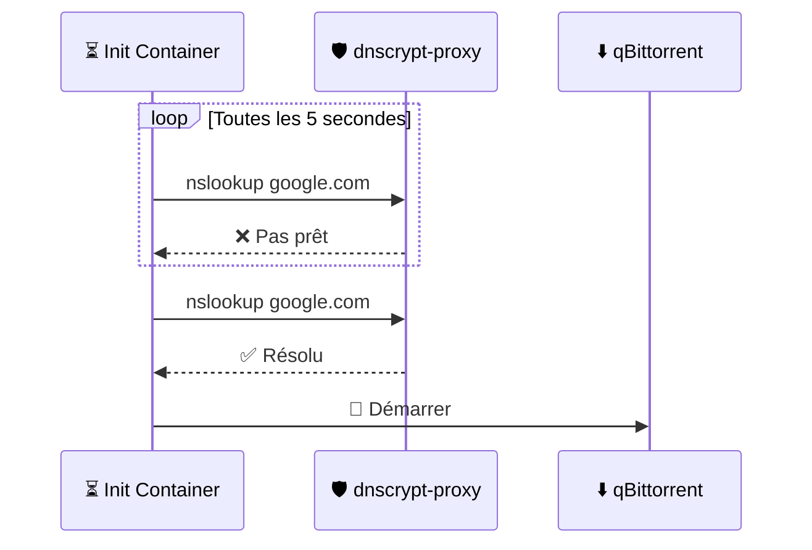
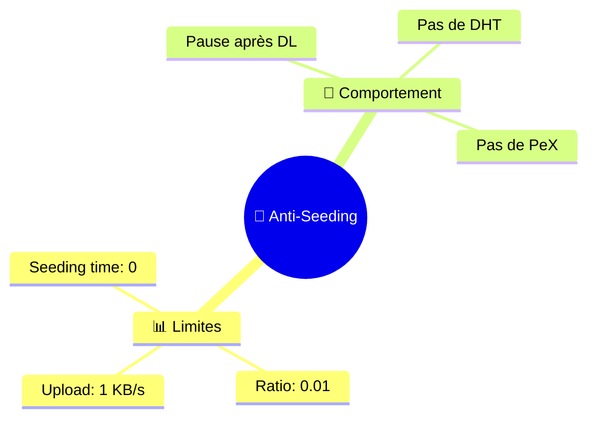

# ⬇️ qBittorrent - Client Torrent

Helm chart pour déployer **qBittorrent** avec configuration anti-seeding et DNS sécurisé.

## 🎯 Objectif



## 📄 Fichiers

| Fichier | Description |
|---------|-------------|
| 📄 `Chart.yaml` | Métadonnées du chart (v1.0.0, appVersion 5.1.4) |
| ⚙️ `values.yaml` | Configuration par défaut |
| 📂 `templates/` | Templates Kubernetes |

### 📂 Templates

| Template | Ressource | Description |
|----------|-----------|-------------|
| 🔧 `_helpers.tpl` | - | Fonctions helper (labels, selectors) |
| 📋 `deployment.yaml` | Deployment | Pod avec init container et startupProbe |
| 🌐 `service.yaml` | Service | NodePort WebUI + Torrent |
| 🛡️ `pdb.yaml` | PodDisruptionBudget | Garantit disponibilité minimale |

## ⚙️ Configuration

```yaml
# values.yaml
image:
  repository: lscr.io/linuxserver/qbittorrent
  tag: "5.1.4"

service:
  webui:
    type: NodePort
    port: 8080
    nodePort: 30080
  torrent:
    type: NodePort
    port: 6881
    nodePort: 30881

persistence:
  config:
    hostPath: /home/muchini/media-data/config/qbittorrent
  downloads:
    hostPath: /home/muchini/media-data/torrents
  media:
    hostPath: /media

# DNS via dnscrypt-proxy
dns:
  dnsProxyService: "dnscrypt-proxy"

environment:
  PUID: "1000"
  PGID: "1000"
  TZ: "Europe/Paris"
  WEBUI_PORT: "8080"

nodeSelector:
  kubernetes.io/arch: arm64
```

## 🏗️ Architecture



## ⏳ Init Container - Attente DNS



## 🚫 Configuration Anti-Seeding



**À configurer dans l'interface WebUI:**
- `Options > BitTorrent > Seeding Limits`
  - Max ratio: `0.01`
  - Max seeding time: `0 minutes`
  - Action: `Pause torrent`

## 🏥 Probes & Haute disponibilité

| Probe | Configuration |
|-------|---------------|
| **livenessProbe** | TCP 8080, delay 60s, period 30s |
| **readinessProbe** | TCP 8080, delay 30s, period 10s |
| **startupProbe** | TCP 8080, period 10s, 30 tentatives max (5 min) |
| **PDB** | minAvailable: 1 |
| **preStop** | sleep 10s (graceful shutdown) |

## ⚠️ Points critiques

| ⚠️ | Description |
|----|-------------|
| 🚫 | **Anti-seeding** - Configurer les limites dans WebUI |
| ⏳ | **Init container** - Attend que dnscrypt-proxy soit prêt |
| 🛡️ | **DNS sécurisé** - Utilise dnscrypt-proxy pour DNS-over-HTTPS |
| 📡 | **NodePort** - Accessible sur `30080` (WebUI) et `30881` (torrent) |
| 🖥️ | **arm64** - NodeSelector force le déploiement sur Raspberry Pi |

## 🔧 Commandes

```bash
# ✅ Valider le chart
helm lint charts/qbittorrent
helm template charts/qbittorrent

# 🔄 Forcer la sync ArgoCD
argocd app sync qbittorrent

# 📊 Vérifier le pod
kubectl get pods -n media-stack -l app=qbittorrent

# 📋 Voir les logs
kubectl logs -n media-stack -l app=qbittorrent -f

# ⏳ Voir les logs de l'init container
kubectl logs -n media-stack -l app=qbittorrent -c wait-for-dns

# 🌐 Accéder à l'interface
# http://192.168.1.51:8080 (via hostPort)
# Login par défaut: admin / adminadmin
```
